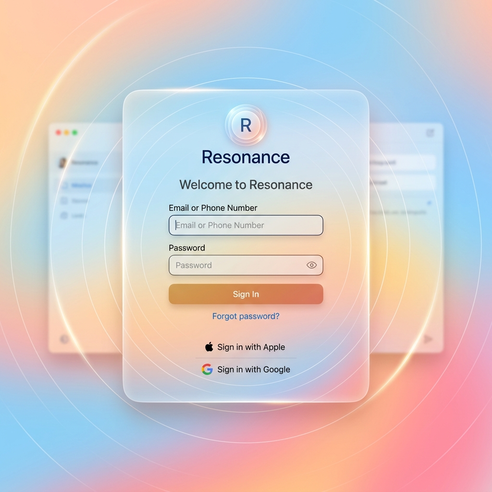
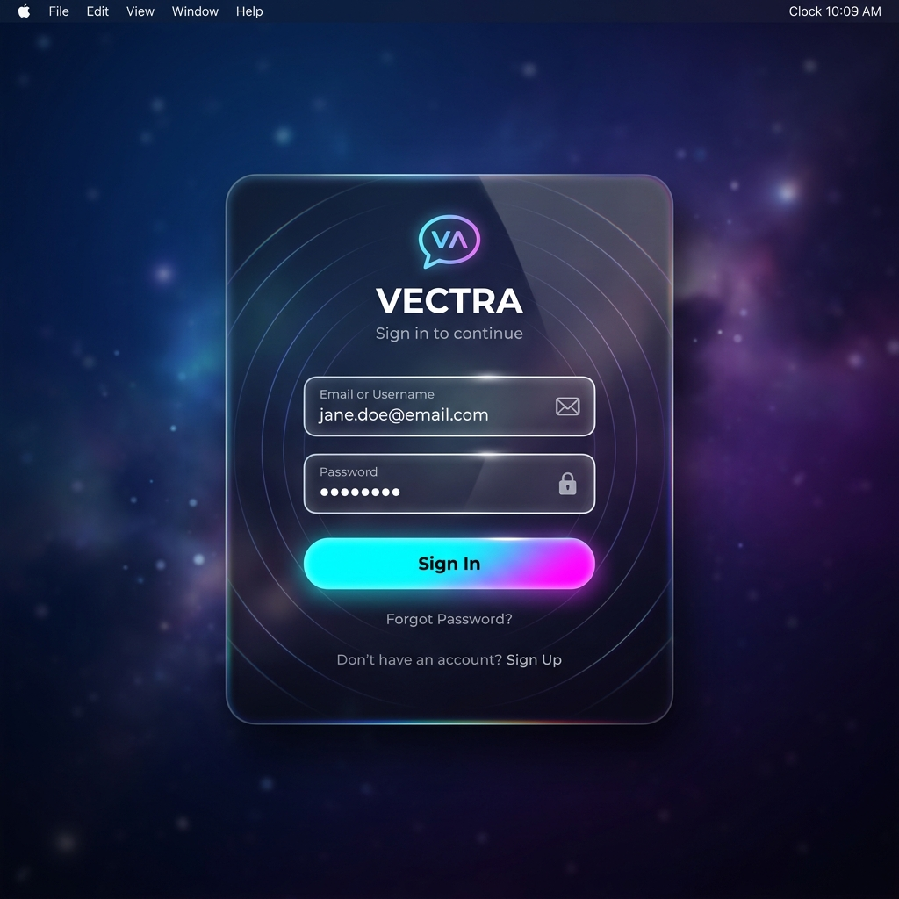
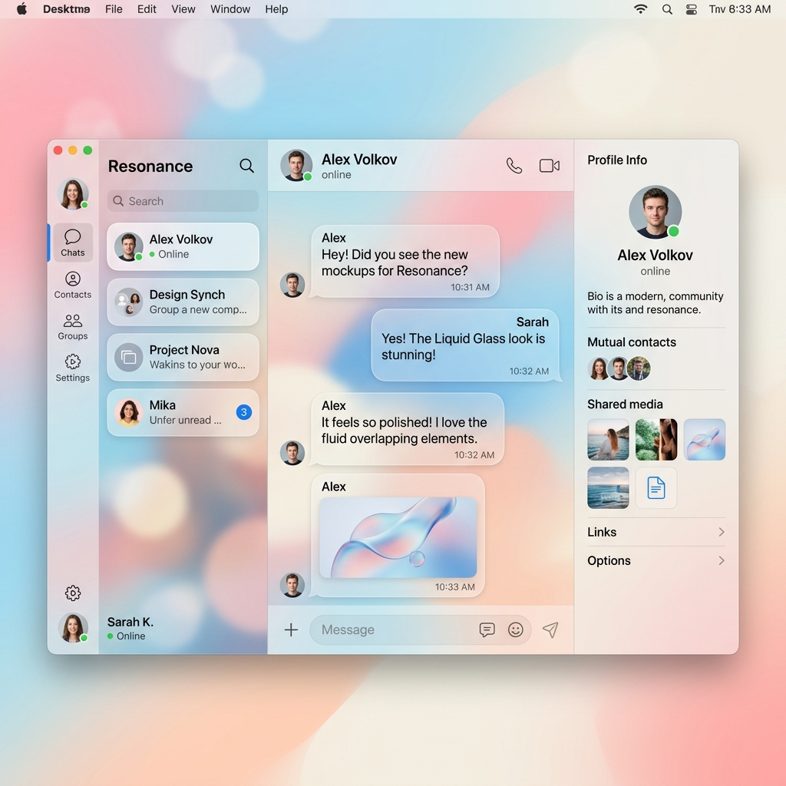
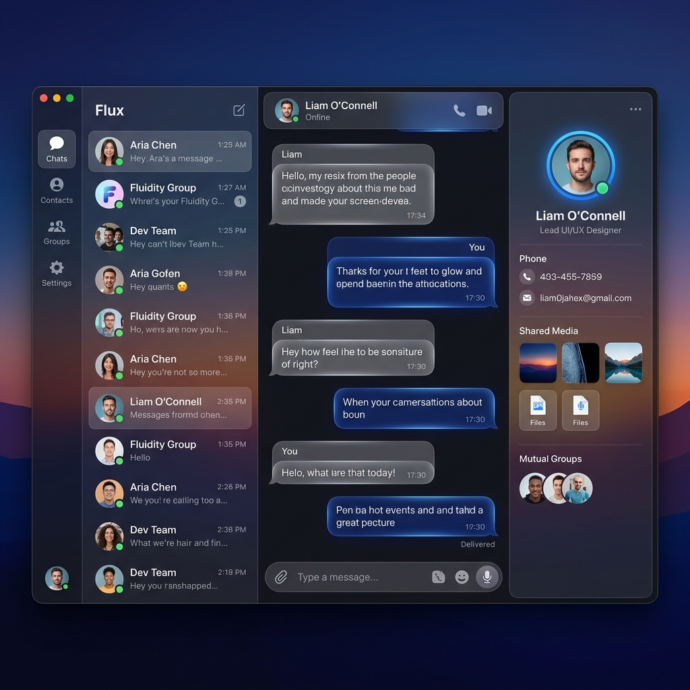

# Resonance IM: Liquid Glass 美学设计概念

在开始编写代码之前，让我们先定义 Resonance IM 的核心视觉锚点。遵循 Frontend Design 工作流的精神，我们拒绝千篇一律的 "AI 风格"（白底、紫色渐变、圆角矩形堆砌），而是大胆选择一条极致路线：**深空幻境 (Abyssal Glass)**。

这是一个融合了 Apple Liquid Glass 设计原则的高级视觉方案。我们将提供 **日间 (Light)** 和 **夜间 (Dark)** 两个完整的主题版本。

## 🎨 设计图览 (Mockup)

我们首先生成了高保真的视觉概念图，它们将作为开发阶段的终极向导：

### 1. 登录体验 (The Portal)
**日间模式 (晨曦)**：采用温暖的日出渐变（蜜桃色到落日空蓝），居中的 Resonance 登录卡片像一块纯净的磨砂玻璃。

**夜间模式 (深空)**：深邃的星空渐变，强烈的辉光和色散。

### 2. 核心三栏布局 (The Interface)
**日间模式**：轻盈的流体玻璃，完美的柔和阴影，气泡重叠层次分明。

**夜间模式**：沉静的氛围，高光的边缘折射。

---

## 🧠 Design Thinking (设计推演)

### 1. 核心定位 (Purpose & Tone)
- **基调：高级、克制、流动环境**。界面不应该是死板的像素，而应该像是在深海或太空中漂浮的一层有光泽的物质。
- **独特性 (Differentiation)**：市面上多数 IM 要么走极致性冷淡风（如 Linear），要么走高纯度果冻风。我们将二者结合：背景是深远而抽象的空间，承载内容的面板则以高级的**折射和辉光**展现材质细节。让人一眼记住这种“悬浮感”。

### 2. 美学准则 (Frontend Aesthetics)

#### A. 空间排布 (Spatial Composition)
- **打碎死板的边框**：放弃全屏无缝拼接的做法。三栏（会话列表、聊天流、右侧详情）不再紧贴屏幕边缘，而是作为相互独立的**悬浮“玻璃砖”**。通过适度的 Padding 暴露出底层的星空/极光壁纸。

#### B. 材质与光影 (Materials & Light)
- 彻底弃用第三方库，采用**原生 CSS + 集中式 SVG Filter Pool** 架构，实现无死角且高性能的光学滤镜。
- **底座 (Base)**：通过 `backdrop-filter: blur(24px)` 构建大面积的透贴遮罩层，让底层壁纸的颜色柔和地透过来。
- **高光与交互 (Highlight & Interaction)**：仅在**关键交互点**（登录卡片面板、核心按钮）使用自研的 `useLiquidGlass` 物理引擎。结合 requestAnimationFrame 驱动的 CSS 变量，提供 3D 透视倾斜、镜面追踪高光和物理弹簧阻尼，打造极其真实的“液态”微交互。重度使用 `box-shadow: inset` 和多层叠加模拟厚实通透的玻璃晶体切面。

#### C. 排版规范 (Typography)
- **摒弃 Inter/Roboto**，我们将采用带有几何科技感或现代优雅风格的无衬线字体（如 `Outfit`、`Clash Display` 作为标题，`Plus Jakarta Sans` 作为正文），实现极高的可读性同时保持个性。
- 对比度：使用纯净的 `rgb(255 255 255 / 90%)` 作为主要文字，而不是生硬的纯白。辅助信息直接降低透明度，而非使用灰色，以保留底色的温度。

### 3. 技术落地策略
- **壁纸即 UI**：整个系统的颜色随着背景壁纸的变化而自动响应。
- 通过 Tailwind 4 建立完备的 CSS Custom Properties (`--glass-opacity`, `--glass-blur`)，确保每一处半透明都能准确映射。
