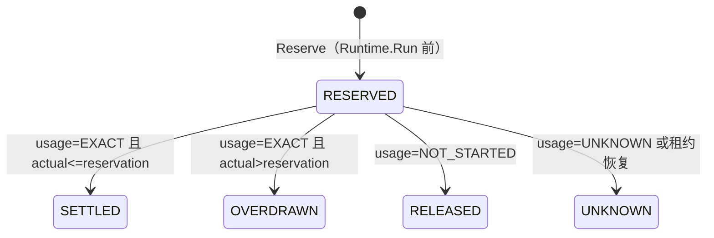

# Agent 租户预算硬门禁验证

## 目标与边界

本切片验证 Pilot 在启动 Pi 前，以 PostgreSQL 权威账本同时执行租户 UTC 日/月 Token 与成本门禁。金额只使用 `int64 micro-USD`；指标、日志和 `AgentRun.Cost` 浮点兼容字段都不是准入事实。

预算 Policy 必须显式存在且 `enabled=true`。`pilot/config` 的 `budget.policy_mode` 唯一允许值为 `require_explicit`，缺失配置默认使用该值；不存在“没有 Policy 就放行”的兼容模式。

同一组 `max_attempt_tokens`、`max_attempt_cost_micros` 与 `max_provider_calls` 会通过 Runtime-neutral `ExecutionLimits` 下沉到可信 Bridge。Bridge 在每次 `before_provider_request` 里先按请求 JSON 字节、模型价格和输出上限做保守预留，再缩小 `max_tokens`；预算不足、价格缺失、Payload 不可解析或调用次数耗尽时同步 Abort，并返回固定 Provider SDK 无法 JSON 序列化的拒绝负载，因此在 HTTP dispatch 前 fail closed。不能只从 Hook 抛错：Pi 0.84.1 会捕获扩展异常并继续使用原 Payload。未使用的预留不返还，宁可提前拒绝，也不允许单次调用突破数据库 reservation。

Pi 0.84.1 的默认手动、阈值和 overflow Compaction 直接调用底层 `streamFunction`，绕过 Agent Loop 的 `before_provider_request`。Bridge 因此注册 `session_before_compact` 并完全接管摘要调用：它把同一个 stateful budget Guard 显式传给 Provider `onPayload`，固定 `maxRetries=0`，把返回 usage 写入 Compaction Entry，并在预算不足、空/超限摘要或任意异常时返回 `cancel`。禁止回退到 Pi 默认 Compaction，因为那会产生未计入 call/token/cost 上界的 Provider 请求。

Runtime host 还会原子写入并在每个 Run 前重新核验私有 `PI_CODING_AGENT_DIR/settings.json`：`retry.provider.maxRetries=0`。这样一次 Bridge 预算决定只对应一次 SDK HTTP attempt；保留的 Agent 外层 retry 每轮都会重新进入 `before_provider_request` 并再次扣减 Provider call/Token/Cost 上界。配置缺失、被篡改或权限不安全时 Run 在启动子进程前失败。

Policy 的单 Attempt Token/Cost 上限还必须小于等于 `9_007_199_254_740_991`，保证 Go `int64` 传入 TypeScript 后仍可精确表示。Repo 入库、Remote Runtime 边界和 Pi 启动前会分别验证该约束。Provider 最终账单若仍因上游计量差异超过 reservation，事实继续记为 `OVERDRAWN` 并阻断后续 Attempt；这属于告警和对账路径，不会把超额事实回滚成成功。

## 权威数据与锁顺序

| 表 | 主键 | 用途 |
| --- | --- | --- |
| `t_agent_budget_policy` | `tenant_id` | 版本化日/月限额和单 Attempt 上界 |
| `t_agent_budget_bucket` | `tenant_id, period_kind, period_start` | 原子保存 `reserved + settled`；`unknown_reserved` 是 reserved 的可观测子集 |
| `t_agent_budget_attempt` | `tenant_id, run_id, attempt` | 固化 tenant/profile/version/run/attempt/fence、Policy 版本和原始周期 |

同一事务中的锁顺序固定为：`AgentRun -> Policy（仅 Reserve）-> Attempt -> DAY Bucket -> MONTH Bucket`。周期由 PostgreSQL `CURRENT_TIMESTAMP` 决定，不能由 worker 本地时钟选择。Reserve 同时检查两个 Bucket：

```text
reserved + settled + max_attempt <= limit
```

任一 Token 或成本、日或月条件失败，整个事务回滚并返回 `ErrAgentBudgetExceeded`。数据库、上下文、Policy 读取失败全部 fail closed。

## Attempt 状态机



- `SETTLED/OVERDRAWN`：从原日/月 Bucket 移除 reservation，并加入实际 Token/micro-USD。
- `RELEASED`：只有 Runtime 明确证明 Prompt 未发送时才移除 reservation。
- `UNKNOWN`：保留完整 reservation，只增加 `unknown_reserved_*` 子集；禁止按零结算。
- 所有终态不可互换；完全相同的 Reserve/Settle 响应丢失重放是幂等的，不同 usage、fence、profile 或 attempt 返回冲突。
- Retry 使用递增的 `AgentRun.Attempt` 创建独立 ledger。租约恢复必须先把旧 `RESERVED` 转为 `UNKNOWN`，再恢复 Run；旧 reservation 继续占用原周期。
- 跨 UTC 日/月完成的调用仍按 Attempt 固化的 `day_period_start/month_period_start` 回写，不能转移到结算时的新周期。

## Coordinator 顺序不变量

```text
Claim -> STARTING_RUNTIME -> Reserve -> Runtime.Run -> RUNNING -> Settle -> Prepare/Fail
```

Budget 拒绝时 `Runtime.Run` 调用次数必须为零。Runtime 启动错误携带 `NOT_STARTED` 时释放；Prompt 可能已发送、Abort、进程崩溃、usage 缺失或非法时一律归一为 `UNKNOWN`。Coordinator 的 Recovery 顺序固定为 Budget Attempt Recovery 在 Agent Run Recovery 之前。

## 自动化矩阵

`repo/agent_budget_test.go` 覆盖：

- EXACT、NOT_STARTED、UNKNOWN、OVERDRAWN 的 Bucket 变化；
- Reserve/Settle 响应丢失重放和终态替换拒绝；
- 缺失/禁用 Policy、陈旧 fence、profile/version 不匹配、取消上下文 fail closed；
- 同租户多 worker 并发只允许余额内的 reservation；同 Attempt 并发只记一次；跨租户隔离；
- UTC 跨日后仍结算原 Bucket，同日门与同月门分别拒绝；
- 崩溃/过期 lease 转 UNKNOWN、重复 Recovery 幂等、Retry 创建下一 Attempt 且旧 hold 不释放。

`pilot/coordinator/coordinator_test.go` 覆盖：

- Reserve 严格发生在 `Runtime.Run` 之前；
- 余额不足不启动 Runtime；
- 启动前失败的 NOT_STARTED 释放；未知启动结果和 Prompt 后崩溃均保留 UNKNOWN hold。

`pilot/bridge/src/index.test.ts` 与 `pilot/runtime/pi/config_test.go` 覆盖：

- 每次 Provider attempt 都消耗调用次数、Token 和 micro-USD 上界；
- 普通生成与 Compaction 共享同一个预算计数器，Compaction 显式关闭 Provider retry；
- Compaction 预算耗尽或摘要失败时返回 `cancel`，不能调用未受 Hook 保护的默认路径；
- 输出 `max_tokens` 被剩余 Token/Cost 的更小值截断；
- 预算耗尽、不可定价或超出 JavaScript 精确整数范围时在 Provider 前 fail closed；
- 拒绝负载不可 JSON 序列化，Pi SDK 内部 Provider retry 固定为 0，篡改 retry policy 时不启动 Run；
- Runtime 环境中的预算变量不能被普通配置覆盖或伪造。

## 执行命令

```bash
go test ./repo -run '^TestAgentBudgetRepo_' -count=1 -v
go test ./pilot/coordinator -count=20
go test -race ./repo -run '^TestAgentBudgetRepo_' -count=20
go test -race ./pilot/coordinator -count=20
go vet ./repo ./pilot/coordinator ./pilot/config
npm --prefix pilot/bridge run typecheck
npm --prefix pilot/bridge test
```

Repo 用例使用 PostgreSQL 17 Testcontainer。若进程无权访问 Docker socket，会明确显示 `SKIP`，不能把该结果计为 PG 实跑通过。

## 手工故障注入

以下步骤在隔离测试环境执行，禁止针对共享或生产数据库：

1. 在 Coordinator 已写入 `RESERVED`、尚未 Settle 时终止 worker（例如停止测试 Pilot 进程）。
2. 等待 lease 到期并触发 `Coordinator.Recover`。
3. 查询旧 Attempt 必须为 `UNKNOWN`，对应两个 Bucket 的 `reserved_*` 不变，`unknown_reserved_*` 增加一次。
4. 允许同一 Run Retry 后，必须出现 `attempt+1` 的新 ledger；再次 Recovery 不得重复增加 unknown 子集。
5. 在 Reserve/Settle 事务提交后、客户端收到响应前断开数据库连接并重试同一请求，Bucket 计数必须只变化一次。
6. 停止 PostgreSQL 或撤销连接权限后发起新 Run，Pi 进程不得启动；恢复数据库不会自动补放被拒绝的调用。

建议同时观察以下只读 SQL：

```sql
SELECT tenant_id, period_kind, period_start,
       reserved_tokens, settled_tokens, unknown_reserved_tokens,
       reserved_cost_micros, settled_cost_micros, unknown_reserved_cost_micros
FROM t_agent_budget_bucket
ORDER BY tenant_id, period_start, period_kind;

SELECT tenant_id, run_id, attempt, profile_id, profile_version,
       policy_version, status, usage_state, reserved_tokens,
       reserved_cost_micros, actual_total_tokens, actual_cost_micros
FROM t_agent_budget_attempt
ORDER BY tenant_id, run_id, attempt;
```

验收时还应确认 `unknown_reserved_tokens <= reserved_tokens`、`unknown_reserved_cost_micros <= reserved_cost_micros`，不存在负数，以及每个成功启动的 Runtime Attempt 都有且只有一条 ledger。
