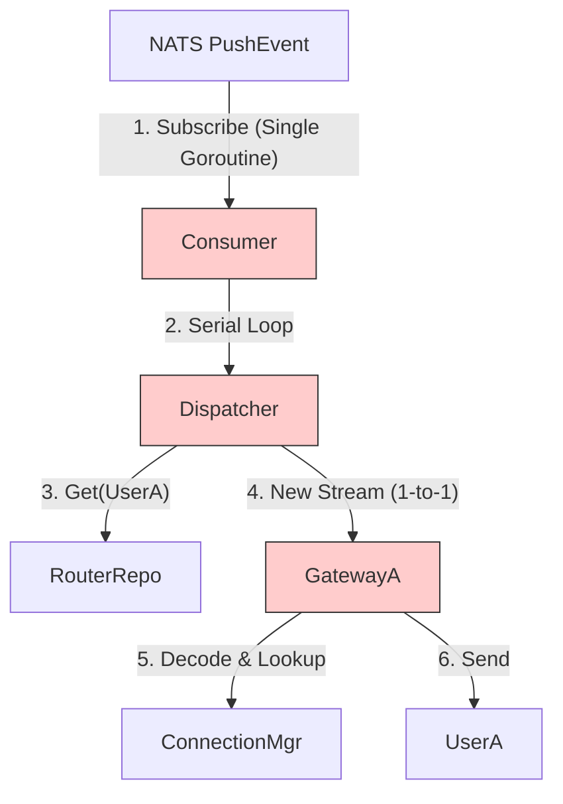

# 全链路服务审计与优化方案 (Task & Gateway)

## 1. 现状审计 (Audit Report)

### 1.1 Task 服务审计
经过对 `task` 服务的代码（Consumer, Dispatcher, Pusher）深度审计，发现以下关键性能瓶颈。

| 问题点 | 严重程度 | 描述 | 影响 |
| :--- | :---: | :--- | :--- |
| **单协程消费** | 🔴 严重 | `WorkerCount` 配置被忽略，Consumer 仅单协程工作。 | 伪并发，单点阻塞导致整体吞吐下降。 |
| **gRPC 连接风暴** | 🔴 严重 | `GatewayClient` 为每条消息创建/销毁流。 | 高 CPU/网络开销，无法利用 HTTP2 复用优势。 |
| **广播风暴** | 🔴 严重 | Proto 仅支持单播，N 人群需 N 次 RPC。 | 带宽浪费，Gateway CPU 浪费在重复解包上。 |
| **串行分发** | 🟠 高 | Dispatcher 串行遍历与推送。 | 延迟与群人数成正比 (O(N))。 |

### 1.2 Gateway 服务深度审计
经过对 `gateway` 的 WebSocket 实现、路由上报及协议设计的深度审计，发现如下细节：

| 模块 | 现状 | 潜在风险/优化点 |
| :--- | :--- | :--- |
| **WS 协议 (WsPacket)** | 使用 `oneof` 区分 `Chat`/`Push`/`Ack`。结构扁平，简单高效。 | 无明显问题。 |
| **连接管理 (ConnMgr)** | `sync.Map` 存储，Read/Write Pump 分离。 | **优秀**。符合最佳实践。 |
| **路由上报 (Presence)** | 使用双向流 `SyncState` 同步状态。 | **可靠性风险**。如果 `Send` 失败，当前逻辑会重置流但**丢弃当前事件**。Logic 层可能状态不一致（用户在线但 Logic 认为离线）。 |
| **上报性能** | 单个事件单个消息。 | **重连风暴风险**。Gateway 重启或网络波动时，大量用户同时上线，会瞬间产生大量 RPC 调用冲击 Logic。 |

### 1.3 架构瓶颈图


---

## 2. 优化方案 (Optimization Strategy)

### 2.1 协议层优化 (Protocol Layer)

**目标**: 消除广播风暴，实现批量投递。

**方案**: 修改 `api/proto/gateway/v1/push.proto`，支持批量目标用户。

```protobuf
message PushMessageRequest {
  // 变更: 支持多个接收者
  repeated string to_usernames = 1; 
  // 变更: 消息体只需传输一次
  PushMessage     message      = 2; 
}

message PushMessageResponse {
  int64  msg_id = 1;
  // 变更: 返回推送失败的用户列表（若为空则全成功）
  repeated string failed_usernames = 4;
  string error = 3;
}
```

### 2.2 Task 端优化 (Task Optimization)

1.  **Consumer 并发架构 (Worker Pool)**:
    *   **修复**: 启用 `WorkerCount`。
    *   **实现**: `JobChannel` + N 个 Worker 协程。Consumer 回调只负责 Dispatch 到 Channel。

2.  **传输层重构**:
    *   **Persistent Stream**: 每个 Gateway 实例维护 1 个长活 gRPC 流。
    *   **Stream Manager**: 自动重连，心跳保活。

3.  **分发逻辑**:
    *   **GroupByGateway**: 将接收者按 GatewayID 分组。
    *   **Batch Push**: 构造包含 `to_usernames` 列表的请求，一次性发给 Gateway。

### 2.3 Gateway 端优化 (Gateway Optimization)

#### 2.3.1 批量推送适配 (Batch Push)
**逻辑变更 (`gateway/push/service.go`)**:
*   接收到 `PushMessageRequest` 后，**仅反序列化一次** Payload。
*   遍历 `to_usernames` 列表，复用 `WsPacket` 对象分发。
*   **收益**: CPU 消耗降低 O(N)，内存分配减少。

#### 2.3.2 路由上报优化 (Presence Reliability)
**逻辑变更 (`gateway/client/gateway_ops.go`)**:
1.  **增加重试机制**: 当 `SyncUserOnline` 失败时，不应直接返回错误，而应放入内部的一个 `RetryQueue` 或无限重试（直到超时）。
2.  **引入批处理 (Batch Reporting)**:
    *   **原理**: 维护一个缓冲队列 (Buffer)。
    *   **机制**: 每 100ms 或 积攒 50 个事件，打包发送一次。
    *   **Proto 变更**: `SyncStateRequest` 增加 `repeated UserOnline` 字段（需修改 Proto）。
    *   **收益**: 削峰填谷，保护 Logic 服务免受重连风暴冲击。

---

## 3. 实施路线图 (Implementation Roadmap)

### Phase 1: 协议升级 (Protocol Upgrade)
- [ ] 修改 `api/proto/gateway/v1/push.proto` (Batch Push)。
- [ ] (可选) 修改 `api/proto/logic/v1/gateway_ops.proto` (Batch SyncState)。
- [ ] 重新生成 Go 代码 (`buf generate`)。

### Phase 2: Gateway 核心优化 (Gateway Core)
- [ ] **Push**: 适配 Batch Push。
- [ ] **Presence**: 增加上报重试机制，防止状态不一致。

### Phase 3: Task 端重构 (Task Refactor)
- [ ] **Consumer**: 实现 Worker Pool。
- [ ] **Pusher**: 实现 Stream Manager。
- [ ] **Dispatcher**: 实现 GroupByGateway 和 Batch Send。

### Phase 4: 验证 (Verification)
- [ ] 单元测试：Mock Gateway 测试 Batch 推送。
- [ ] 压力测试：模拟 1000 人群消息及 1000 人并发上线。

---

## 4. 扩展性思考

*   **大群读扩散**: 针对万人群，建议引入 "Timeline" 模式（Pull 模型）。
*   **流控 (Flow Control)**: Gateway 端应增加发送缓冲区的监控，当某个用户写入过慢时（TCP 窗口满），主动断开连接，防止阻塞 Gateway 内存。
